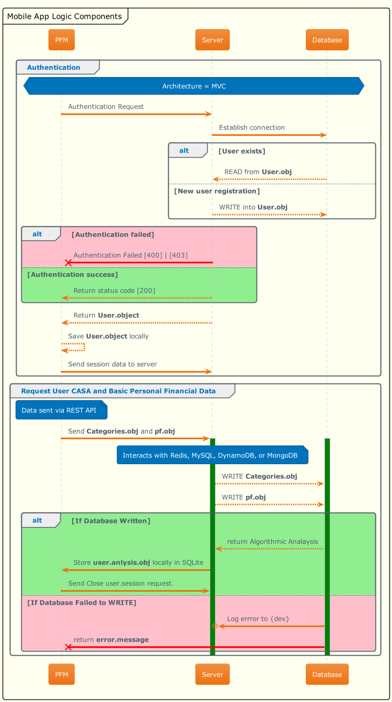

# Paynet PFM - Mobile App Flow and Logic Components Documentation

Welcome to the documentation for **Paynet PFM**. This document outlines the overall architecture and logic implemented in the mobile application, using PlantUML diagrams to provide a clear visual representation of both the app flow and the underlying logic components.

---

## Table of Contents

1. [Introduction](#introduction)
2. [App Flow Overview](#app-flow-overview)
3. [Logic Components](#logic-components)
4. [How to Read the Diagrams](#how-to-read-the-diagrams)
5. [Contributing](#contributing)

---

## Introduction

Welcome to **Paynet PFM**! This repository is designed to help junior developers understand the architecture and flow of the mobile application. The app employs the Model-View-Controller (MVC) design pattern, which divides the application logic into three interconnected components:

- **Model:** Manages data and business rules (e.g., User and Categories).
- **View:** Handles user interface and presentation (Frontend logic).
- **Controller:** Acts as an intermediary between Model and View (e.g., DatabaseHandler).

The diagrams below will guide you through the application flow and the interaction of different logic components.

---

## App Flow Overview

The **App Flow** diagram provides a visual representation of how the **Paynet PFM** application processes user interactions, authentication, and data storage.

### Key Features:

1. **Authentication Process:**

   - The app verifies user credentials against a backend server.
   - If the user is new, their details are written into the database.
   - On successful authentication, user data is stored locally.

2. **Request for Personal Financial Data:**
   - The app sends user financial data (`Categories.obj` and `pf.obj`) via a REST API to the server.
   - Data is written into the database (Redis, MySQL, DynamoDB, MongoDB) and analyzed.
   - The result is returned to the app for local storage.

### Notable Logic:

- Authentication and financial data interactions are managed using structured error handling for database operations.
- Sessions are managed for secure communication between the app and server.

---

## Logic Components

The **Logic Components** diagram provides a structural view of the main backend and frontend classes, including their relationships and methods.

### Backend:

- **`DatabaseHandler`:** Handles database operations like reading, writing, updating, and deleting user data.

  - Example Methods:
    - `writeUser(User)`: Saves a new user to the database.
    - `updateUser(User)`: Updates existing user information.
  - Relationships:
    - Composes the `User` struct and interacts with `Categories`.

- **`User`:** A simple data structure containing user information like name, email, and password.

- **`Categories`:** An enum-like structure defining various financial categories.

### Frontend:

- **`Authentication`:** Handles user-related operations like registration and account deletion.
  - Example Methods:
    - `register(User)`: Registers a new user.
    - `requestAccountDeletion`: Initiates an account deletion request.

### Relationships:

- Backend and Frontend components share the `User` struct to maintain consistency across the architecture.

---

## How to Read the Diagrams

1. **Class Diagram Notations:**

   - **Solid Lines:** Represent direct associations or dependencies.
   - **Dashed Lines:** Represent weaker dependencies or temporary interactions.
   - **Arrows (`-->`, `<--`, `o--`, `*--`):**
     - `-->`: Indicates direction of dependency.
     - `o--`: Aggregation (e.g., one object references another but doesn't own it).
     - `*--`: Composition (e.g., one object owns another).

2. **App Flow Diagram:**

   - Rectangular boxes represent components (e.g., `Server`, `Database`).
   - Colored annotations and arrows denote the flow of operations and decision-making.

3. **Skinparam and Themes:**
   - Diagrams use specific themes (`aws-orange`, `mars`) to make them visually distinct and easier to follow.

---

## Contributing

To contribute:

1. Clone the repository and check out the diagrams under this folder.
2. Review the `App Flow` and `Logic Components` diagrams for any updates or improvements.
3. Submit a pull request with your changes and provide a brief explanation in the description.

### Updating the Diagrams

The PlantUML source files for the diagrams can be found in the `PayNetHackathonArchitecture` folder. To regenerate the images:

1. Install a PlantUML renderer (e.g., IntelliJ plugin, VSCode plugin, or standalone jar).
2. Edit the `.puml` files and export the updated diagrams as PNGs.

---

We hope this documentation clarifies the structure and flow of the **Paynet PFM** application. Feel free to reach out with questions or suggestions!

Happy coding! 🚀
